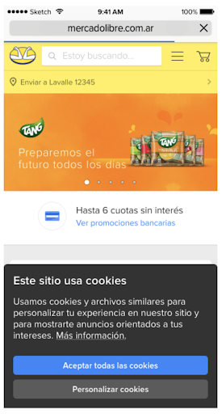
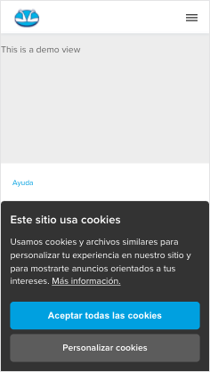

# @frontend-cookies-manager/cookies-consent-banner

> This module returns markup, scripts, styles and cookies data needed to render a cookies disclaimer/consent banner if conditions applies.

## Getting Started

This module includes all components, client components and styles for the render.

|||
|---|---|

## Usage

### Example

```
const { getDynamicContent } = require('@frontend-cookies-manager/cookies-consent-banner');

const cookiesConsentBanner = getDynamicContent({
    platform: {
        id: 'ML',
        siteid: 'MLA',
        domain: 'mercadolibre.com.ar',
    },
    userPreferences: {
        categories: {
            advertising: null,
        },
    },
    dynamicContentOptions: {
        disableCookiesConsentBanner: false,
    },
    applicationId: 'app-demo',
    scopeId: 'testdemo',
    headers: {
        host: 'www.mercadolibre.com.ar',
        ...
    },
    cookies: {
        _d2id: '1a1a1aaa-11aa-111a-aaa1-a111a1aaaa1a',
        ...
    },
    device: {
        type: 'desktop',
        mobile: false,
        tablet: false,
        desktop: true,
        forced: false,
        originalType: 'desktop',
        lowEnd: false,
        webView: false,
        pciCompliant: true,
        nativeWebview: false,
        webviewUserAgent: {},
        osName: 'mac os x',
        osVersion: '11.2.1',
        memory: '8',
        dpr: '1.8',
        viewportWidth: '1867',
        rtt: '100',
        downlink: '2.45',
        ect: '4g'
    },
    browser: {
        support: {
            webp: true,
            prefetch: true,
            preconnect: true,
            pushNotifications: false,
            serviceWorkers: false,
            brotli: true,
            sameSite: true
        },
        name: 'chrome',
        version: '89.0.4389',
        major: '89',
        minor: '0',
        patch: '4389',
        userAgent: 'Chrome 89.0.4389 / Mac OS X 11.2.1',
        outdated: false
    },
    feConfigEnvironment: 'production',
    userId: 123456789,
    layoutVersion: '3.49.2-beta-dynamic-content-3',
    experiments: {},
    originalUrl: '/some/path',
    isFallback: false,
  });
```

Returns

```
{
    "markup": "<div role=\"region\" class=\"cookie-consent-banner\">...</div>",
    "styles": [
        {
            "renderChildrenInPlace": false,
            "code": ".cookie-consent-banner{position:fixed..."
        }
    ],
    "scripts": [
        {
            "code": "(function(){var ccb=function(e)..."
        }
    ],
    "cookies": [],
    "position": "bottom"
}
```

### Object props of getDynamicContent
| Property | Type | Default | Description |
| -------- | ----------- | ---- | ------- |
| `userId` | number or null | null | Data from req.user.id |
| `platform` | object | `{}` | Data from req.platform |
| `userPreferences` | object | `{}` | Object of cookies categories |
| `dynamicContentOptions` | object  | `{}` | Object with options like disableCookiesConsentBanner|
| `applicationId` | string | null | name of application |
| `scopeId` | string | production | name of scope |
| `device` | object | null | Data from req.device |
| `browser` | object | null | Data from req.browser |
| `headers` | object | null | Data from req.headers |
| `cookies` | object | null | Data from req.cookies |
| `feConfigEnvironment` | string | production | Environment for frontend-config scopes |
| `req` | object | null | Optional req object |

## Running the tests

Run tests in main package

```
npm run test
```

## Support

If you have any question related to this module please contact us on the [#team-frontendcore](https://meli.slack.com/archives/CS9E8LJ8Z) slack channel or via email [frontendcore@mercadolibre.com](mailto:frontendcore@mercadolibre.com)

## Versioning

Please check [README.md](../../README.md) in the project root.

## Contributing

In order to contribute to this library, you must read [this guide](https://github.com/mercadolibre/fury_frontend-nordic/blob/master/docs/contributing.md#contributing-guidelines) first.

## Changelog

We keep changes to our codebase [here](../../CHANGELOG.md)

## License

© 2021 Mercado Libre
