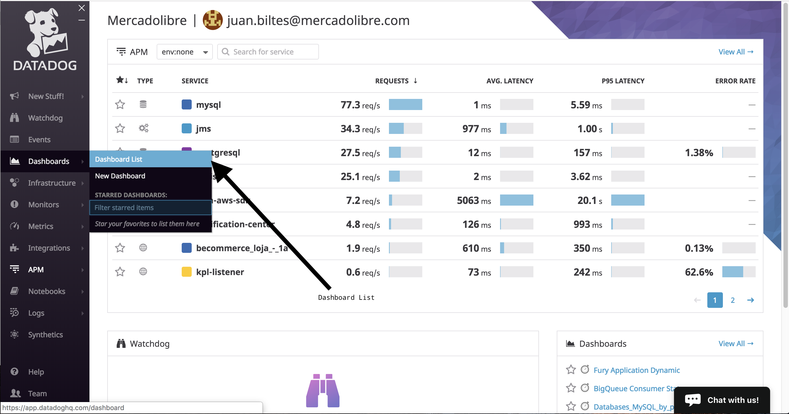
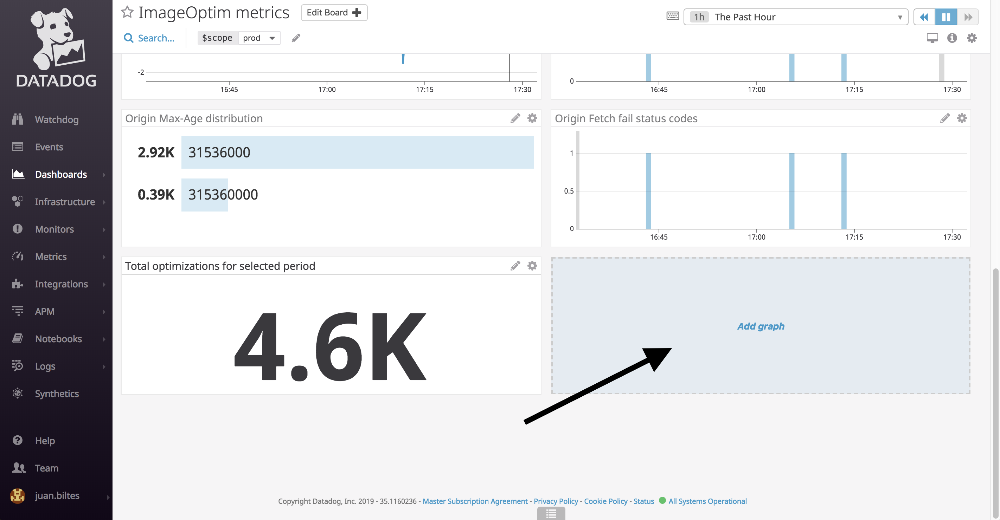
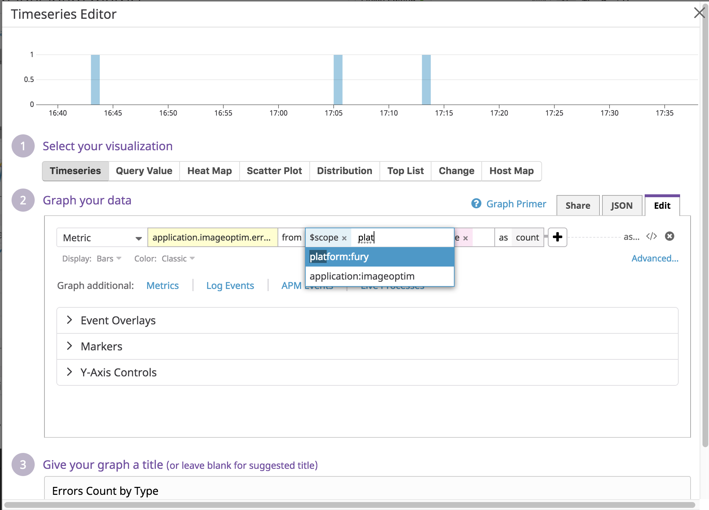

# frontend-statsd

> Allows you to have custom metrics from your server

`frontend-statsd` allows you to track custom metrics from your server using the [StatsD standard](https://thenewstack.io/collecting-metrics-using-statsd-a-standard-for-real-time-monitoring/) (which is used by **Datadog**!).

## Installation

```bash
npm install --save frontend-statsd --registry http://registry.npm.ml.com
```

# Table of Contents
- [Usage](#usage)
  - [Quick Start](#quick-start)
  - [Metrics Specification](#Metrics-Specification)
  - [Configuration](#Configuration)
- [Usage in datadog](#usage-in-datadog)
  - [How to create a dashboard](#how-to-create-a-dashboard)
  - [How to create a widget](#how-to-create-a-widget)
  - [How to read your data](#how-to-read-your-data)
- [Internal Client](#Internal-Client)

# Usage

## Quick Start
After installment just include it in your app and you're good to go:

``` js
const statsd = require('frontend-statsd');


const sampleRate = 1; // I want to track 100% of the executions
const statName = 'renderSomething.duration';
const myCustomTags = { logged: user.logged, referrer: 'vip' };

const start = Date.now(); // Start timer
renderSomething(); // Some complex rendering I want to analyze
const duration = (Date.now() - start); // End timer

const value = duration

statsd.gauge(statName, value, sampleRate, tags); // The track!
```

Refer to our statsd client docs, [the hot-shots module](https://github.com/brightcove/hot-shots#usage), to see available methods

**And that's it, now you can see your data on Datadog dashboards!** See [Metrics Specification](#Metrics-Specification) to see how your data is being tracked.

## Metrics Specification

- **Bucket Prefix:** **application.${appName}** \
Every metric that you create with this module will be tracked with this prefix. This is so you can easily find all your metrics (e.g: searching by `application.homes-palpatine` will show all the buckets from homes-palpatine) \
*Note: The `fury_` prefix won't be used*
- **Global Tags:** \
By default you'll have the following tags in your tracks:
  - platform
  - application
  - scope

If you have specific need for the metrics specification then refer to [Configuration](#Configuration)

## Configuration

The solution is already configured to track to datadog as described in [Metrics Specification](#Metrics-Specification), so there's no need for you to touch any configuration unless you really need some custom behaviour. The default configuration is as follows:

``` js
  host: 'datadog', // non overridable
  prefix: `application.${env.APPLICATION || env.npm_package_name}.`, // non overridable
  maxBufferSize: 10000,
  mock: !env.FURY, // non overridable
  globalTags: {
    platform: env.PLATFORM, // non overridable
    application: env.APPLICATION, // non overridable
    scope: env.SCOPE, // non overridable

    // You can add tags!
  },
```

If you need to modify the config (see [hot-shots parameters](https://github.com/brightcove/hot-shots#usage)) then you can do so in your project config (files under `config/`).

Example:
``` js
// fury_homes-palpatine/config/default-production.js

const config = {
 statsd: {
   maxBufferSize: 15000,
 }
}
module.exports = config
```


# Usage in Datadog

If you already know how to use Datadog then you can go straight to [How to read your data](#how-to-read-your-data)

## How to create a dashboard

To create a dashboard just go to Dashboard List (see next image) and follow [these instructions](https://docs.datadoghq.com/graphing/dashboards/#dashboard-list)



Next, you'll need to create a widget

## How to create a widget

Once you've created your dashboard you'll have to add widgets to it. You can do so by clicking here:



Next it'll ask you to choose one type of widget. [Here's](https://docs.datadoghq.com/graphing/widgets/) a list of all of these and the documentation about how to use each. \

See [How to read your data](#how-to-read-your-data) to fill them

## How to read your data

This part has mostly been said in [Metrics Specification](#Metrics-Specification).
The metric (a.k.a. tag names) are as follow:

```
// Note that appName won't include the fury_ prefix

application.${appName || npmPckgName}.${statName}
```

So, for the example described in [Quick Start](#quick-start), the metric will be found in Datadog as `application.homes-palpatine.renderSomething.duration`

Your tags can be used to filter or segreggate your data. Here's an example of a Timeseries in the [project imageoptim](https://app.datadoghq.com/dashboard/5jw-rgv-a3c/imageoptim-metrics?tile_size=m&page=0&is_auto=false&from_ts=1553196720000&to_ts=1553200320000&live=true):




# Internal Client

The module offers an internal instance of StatsD to use outside of a frontend application.

Every metric that you create using this client will not have the prefix `application.${appName}`.
You must define the full stat name.

For example, it could be use from a module provided by Nordic to send a core metric.

``` js
const statsdInternal = require('frontend-statsd/internal');

// ...

const start = Date.now(); // Start timer
if (!noneLayout) {
  const LayoutWithProps = React.createElement(LayoutComponent, props);
  html = ReactDOMServer.renderToStaticMarkup(LayoutWithProps);
}
const duration = (Date.now() - start); // End timer

statsdInternal.gauge('nordic.render_layout.duration', duration); // Sent a Nordic core metric!

// ...

```
